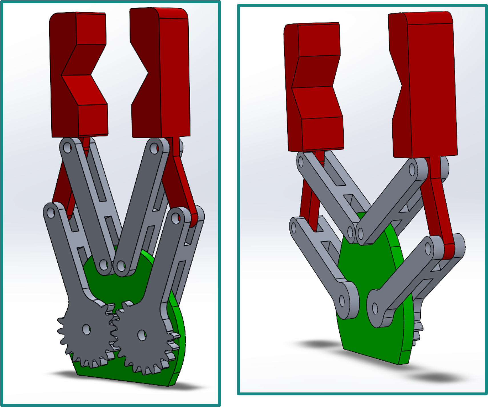

<!-- # gear_gripper_solidworks
Design, kinematic and static analysis of a parallelogram gripper mechanism in SolidWorks
-->
# Parallelogram Gripper Design

Design, kinematic, static analysis, and simulation of a gripper with a parallelogram mechanism, developed using SolidWorks and MATLAB.

## 🎯 Overview
This project focuses on the **design, kinematic study, static analysis, and simulation** of a gripper featuring a parallelogram mechanism.  
The objective was to create a device capable of gripping objects while maintaining a **constant orientation** of the jaws, due to the geometry of the parallelogram.

## 🧰 Technologies
- 
- 
- 
- 

## ⚙️ Description
- Modeled the **gripper structure** and designed the parallelogram mechanism in SolidWorks.  
- Performed **kinematic** and **static** simulations to analyze the mechanical behavior.  
- Processed and visualized the simulation data using **MATLAB**.  
- Verified the constant orientation of the end-effector and the stability of the grip.

## 🧪 Results
The analyses confirmed that the parallelogram mechanism ensures a **stable, symmetric, and precise grip**, maintaining the jaw orientation throughout the motion.

## 🖼️ Preview

  

## 📁 Repository Structure
- src/ → SolidWorks part and assembly files
- docs/ → Project report and documentation
- results/ → MATLAB plots
- images/ → CAD renders and simulation results

## 👤 Authors
Developed by [Tommaso Savino](https://github.com/ItsTomSav) and [Francesco Savino](https://github.com/FrankSav80).  
Master’s Degree in Automation Engineering, Politecnico di Bari.

